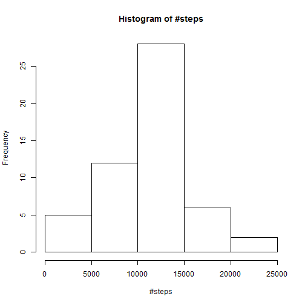
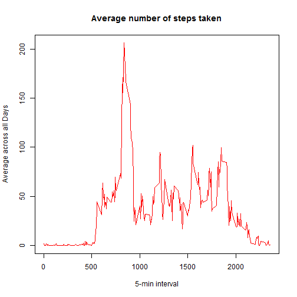
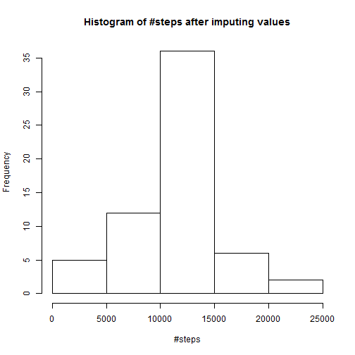

## Loading and preprocessing the data


```r
setwd("C:/Users/Uday/Desktop/Coursera/repres")
```

```
## Error in setwd("C:/Users/Uday/Desktop/Coursera/repres"): cannot change working directory
```

```r
y <- read.csv("activity.csv", header=TRUE)
x <- subset(y, !(is.na(steps)))
z <- aggregate(x$steps, FUN= sum, list(x$date))
z3 <- aggregate(x$steps, FUN= mean, list(x$interval))
```

## What is mean total number of steps taken per day?

```r
hist(z$x, xlab = "#steps", main = "Histogram of #steps")
```

 

```r
mean(z$x)
```

```
## [1] 10766.19
```

```r
median(z$x)
```

```
## [1] 10765
```

## What is the average daily activity pattern?

```r
time_series <- tapply(y$steps, y$interval, mean, na.rm = TRUE)
plot(row.names(time_series), time_series, type = "l", xlab = "5-min interval", 
    ylab = "Average across all Days", main = "Average number of steps taken", 
    col = "red")
```

 

## Imputing missing values
### This procedure will take the data into a data frame and use 2 for loops to
### populate any NA values in the steps data. The data populated will be from the ### summary for the time interval (across dates) in question where the NA occurs
### a histogram is generated after values are imputed

```r
MyData <- y
for (i in 1:nrow(MyData))
     {if (is.na(MyData[i,1]))
        {for (j in 1: nrow(z3))
            {if (MyData[i,3] == z3[j,1])
              MyData[i,1] <- z3[j,2]
          }
        }
      }

write.csv(MyData, file = "MyData.csv")
z <- aggregate(MyData$steps, FUN= sum, list(MyData$date))
hist(z$x, xlab = "#steps", main = "Histogram of #steps after imputing values")
```

 

## Are there differences in activity patterns between weekdays and weekends?

```r
df <- data.frame(date= MyData$date, dayofwk = as.POSIXlt(MyData$date)$wday, steps = MyData$steps, interval = MyData$interval)

stepsByDay <- aggregate(steps ~ interval + dayofwk, data = df, mean)
names(stepsByDay) <- c("interval", "dayofwk", "steps")

stepsByDay$daytype <- ifelse((stepsByDay$dayofwk == 0 |stepsByDay$dayofwk == 6),"weekend", "weekday")

stepsByDaytype <- aggregate(steps ~ interval + daytype, data = stepsByDay, mean)
names(stepsByDaytype) <- c("interval", "daytype", "steps")

library(lattice)
xyplot(steps ~ interval | daytype, stepsByDaytype, type = "l", layout = c(1, 2), 
      xlab = "Interval", ylab = "Number of steps")
```

 
